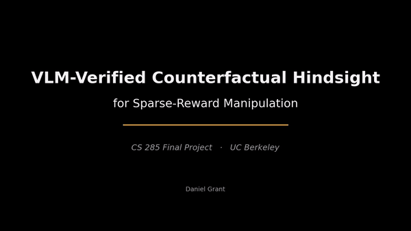
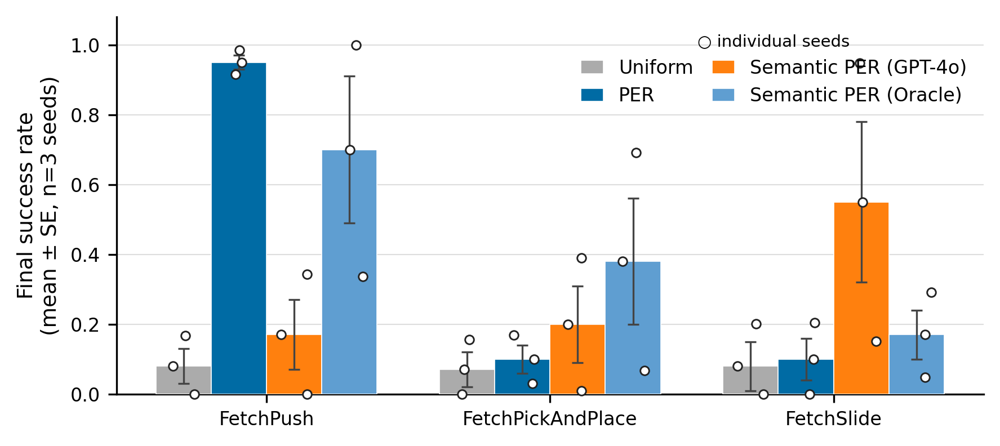
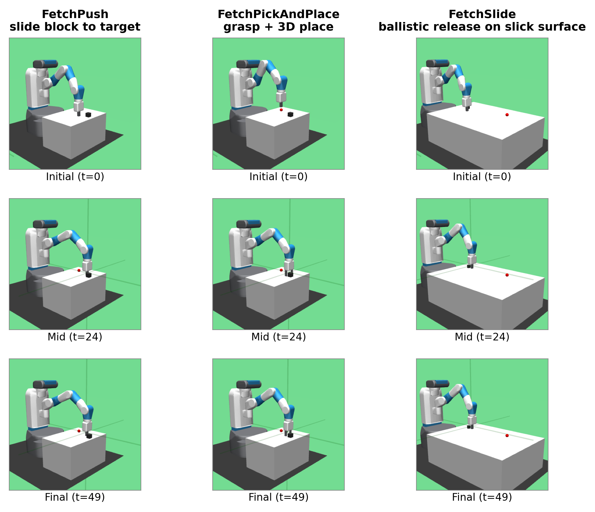
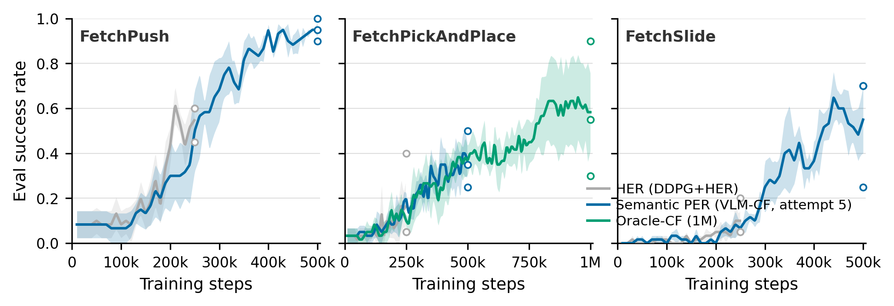

# VLM-Verified Counterfactual Hindsight

[](LICENSE)
[](https://www.python.org/)
[](https://wandb.ai/)
[](https://modal.com/)

> **CS 285 Final Project (Spring 2026) — UC Berkeley**
> Daniel Grant, Parshawn Gerafian, Matei Gardea

**VLM-Verified Counterfactual Hindsight for Sparse-Reward Manipulation**
([NeurIPS preprint, 44 pp.](agent_reports/paper/main.pdf)) ([CS 285 submission, 45 pp.](agent_reports/cs285_final_paper.pdf))

<p align="center">
  
</p>

<p align="center">
  <a href="agent_reports/videos/project_overview.mp4">Higher-quality MP4 (50s, 0.8MB)</a>
</p>

---

## Overview

Sparse-reward manipulation is fundamentally a credit-assignment problem. With only one reward bit at the end of a 50-step episode, every standard TD-error signal decays exponentially back from the terminal timestep, leaving the bulk of each trajectory effectively invisible to the optimizer. In Gymnasium-Robotics Fetch environments—a canonical benchmark with a 5 cm goal-achieved threshold—a randomly initialized policy succeeds in under 1% of episodes, so the early replay buffer contains almost no positive signal to propagate.

This project makes two algorithmic contributions. **Semantic PER** recasts VLM-guided experience replay as importance-sampled posterior reweighting: a frozen VLM emits an approximate posterior over which timestep caused an episode's failure, and we multiply the standard PER priority by this posterior. The multiplicative form admits a clean IS-correction analysis; under VLM miscalibration, only sampling variance is inflated—the value target is never corrupted. This is a structural contrast with the additive mixture in the concurrent VLM-RB work (Sharony et al. 2026), which implicitly retargets the loss. **VLM-Verified Counterfactual Hindsight** closes the dominant failure mode of language-only counterfactuals: rather than asking a VLM for a hindsight goal position (which triggers teleport-collapse in 100% of Opus 4.7 calls on FetchPush), we ask for a corrective action sequence and execute it in a simulator fork. Only trajectories whose sparse reward fires under unmodified dynamics enter the buffer—confidence 1.0, zero modeling error.

A two-vendor, three-model prompt sweep (GPT-4o / Claude Opus 4.7 / Sonnet 4.5) on 6 synthetic and 10 real Fetch failures identifies `(GPT-4o, achieved_goal + 5 cm gate)` as the dominant configuration (0% teleport-collapse, plausibility 0.79, goal-progress 0.83). A 12-episode cross-task pilot achieves 12/12 task-relevant annotations across Push, PickAndPlace, and Slide with a single prompt template.

---

## Headline Results



*Fig. 1: Pre-fix semantic-PER ablation. Mean ± SE across 3 seeds. The GPT-4o curve reflects a known-buggy pipeline (see paper §6); the Oracle and PER/Uniform baselines are unaffected and provide valid interpretable structure.*

VLM-CF Phase 2 (all 9 runs completed at 500k steps, W&B tag `path_c_overnight`):

- **FetchPush**: VLM-CF reaches mean success 0.95 ± 0.03 at 500k steps—matching PER's asymptote at 3M steps and substantially exceeding HER@250k (0.617).
- **FetchSlide**: VLM-CF reaches 0.55 ± 0.13 at 500k steps, a gain of +0.37 over HER@250k (0.183) and +0.45 over PER@3M (0.10)—a striking result on the task where prior baselines cluster near zero.
- **FetchPickAndPlace**: VLM-CF reaches 0.367 ± 0.08 at 500k steps, exceeding HER@250k (0.133).

---

## Three Fetch Environments



*Fig. 2: The three Gymnasium-Robotics Fetch tasks used in experiments (columns: FetchPush, FetchPickAndPlace, FetchSlide), rendered at t=0, t=24, and t=49 of a deterministic rollout from seed 42. Each task has a 50-step horizon, 4-dimensional continuous action (end-effector dx/dy/dz plus gripper), and sparse binary reward with a 5 cm success threshold.*

| Environment | Task | Why it is hard |
|---|---|---|
| **FetchPush-v4** | Push a block to a 2D table target | TD-error finds contact events; PER largely solves this at 3M steps |
| **FetchPickAndPlace-v4** | Pick up a block and place it at a 3D target | Two sequential contact events; grasping failures are visually salient for VLM localization |
| **FetchSlide-v4** | Hit a puck on a frictionless table so it slides to a distant target | Ballistic release; TD-error is uniformly low after the throw window |

---

## Learning Curves



*Fig. 3: Evaluation success rate vs. training steps, faceted by environment. Shaded bands show ±1 SE across 3 random seeds. The HER baseline is truncated at 250k steps (its pre-registered horizon); Oracle-CF runs continue to 1M steps. Note Oracle-CF's mid-training climb on PickAndPlace.*

---

## Quickstart

### Local setup (plotting, code exploration)

```bash
git clone https://github.com/DJRGVC/RL_project_185.git
cd RL_project_185
python -m venv .venv && source .venv/bin/activate
pip install -r requirements.txt

# Configure API keys
cp .env.example .env
# Edit .env — add OPENAI_API_KEY, ANTHROPIC_API_KEY, and WANDB_API_KEY
```

> **Note:** MuJoCo training requires Linux x86_64 with a GPU. Use Modal for actual training runs (see below).

### Single training run (local, Linux + GPU)

```bash
# Standard PER baseline
python train.py --config configs/per.yaml env.name=FetchPush-v4 training.seed=42

# VLM counterfactual hindsight (GPT-4o)
python train.py --config configs/vlm_cf.yaml env.name=FetchPickAndPlace-v4 training.seed=42

# Simulator-verified counterfactual hindsight
python train.py --config configs/verified_cf.yaml env.name=FetchSlide-v4 training.seed=42
```

### Cloud training (Modal A10G)

```bash
pip install modal
modal token new    # opens browser for authentication

# Create Modal Secret named "semantic-per-secrets" at modal.com → Secrets → Create
# Keys: OPENAI_API_KEY, ANTHROPIC_API_KEY, WANDB_API_KEY, WANDB_ENTITY, WANDB_PROJECT

# Verify with a short smoke test
modal run modal_app.py --config configs/uniform.yaml --extra "training.total_steps=1000"

# Single run
modal run modal_app.py --config configs/vlm_cf.yaml --extra "env.name=FetchPush-v4"

# Full ablation (all methods, all envs, all seeds) — --detach required
modal run --detach modal_app.py::run_ablation

# Monitor
modal app list
modal app logs <app-id>
```

### Plot results from W&B

```bash
python scripts/plot_results.py \
    --wandb_project RL_project \
    --wandb_entity <your-entity> \
    --out_dir plots/
```

---

## Repository Structure

```
RL_project_185/
│
├── train.py                         # Main training loop (SAC + HER + CF-HER + Verified-CF + Semantic-PER)
├── evaluate.py                      # Standalone evaluation script
├── modal_app.py                     # Modal cloud deployment (A10G GPU, headless MuJoCo)
│
├── configs/
│   ├── base.yaml                    # Shared SAC/training hyperparameters
│   ├── uniform.yaml                 # Uniform replay baseline
│   ├── per.yaml                     # Standard PER (Schaul et al. 2015)
│   ├── semantic_per.yaml            # Semantic PER with GPT-4o failure localization
│   ├── semantic_per_heuristic.yaml  # Semantic PER with privileged-state Oracle localizer
│   ├── her.yaml                     # HER (k=4, future strategy)
│   ├── her_per.yaml                 # HER + PER combined
│   ├── vlm_cf.yaml                  # VLM counterfactual hindsight (main method)
│   ├── verified_cf.yaml             # Simulator-verified counterfactual hindsight
│   ├── oracle_cf.yaml               # Oracle-CF (privileged-state ceiling)
│   └── vlm_rb.yaml                  # Sharony et al. VLM-RB reproduction
│
├── src/
│   ├── agents/
│   │   └── sac.py                   # SAC: twin Q-networks, auto entropy tuning, gradient clipping
│   ├── buffers/
│   │   ├── replay_buffer.py         # Uniform ring buffer O(1)
│   │   ├── per_buffer.py            # PER with SumTree O(log N)
│   │   ├── semantic_buffer.py       # Semantic PER: multiplicative priority blending
│   │   ├── counterfactual_buffer.py # CF-HER replay buffer
│   │   ├── her_buffer.py            # HER wrapper (k=4, future strategy)
│   │   └── vlm_rb_buffer.py         # VLM-RB reproduction (Sharony et al.)
│   ├── envs/
│   │   └── wrappers.py              # FlattenGoalObs + FrameCapture wrappers
│   ├── vlm/
│   │   ├── localizer.py             # GPT-4o + heuristic Oracle failure localizer
│   │   ├── counterfactual.py        # VLM prompting and CF generation
│   │   ├── verified_counterfactual.py  # Simulator-verified CF mechanism
│   │   ├── oracle_cf.py             # Privileged-state oracle (ceiling for VLM-CF)
│   │   └── vlm_rb_scorer.py         # Clip-level VLM scorer for VLM-RB
│   └── utils/
│       ├── keyframes.py             # Keyframe selection and frame-index mapping
│       └── logger.py                # TensorBoard + W&B logger
│
├── scripts/
│   ├── plot_results.py              # Multi-run W&B comparison plots
│   ├── plot_training.py             # Single-run live dashboard
│   └── run_ablation.sh              # Full 3 envs × 4 methods × 3 seeds sweep
│
├── agent_reports/
│   ├── paper/main.tex               # NeurIPS-format paper source
│   ├── paper/main.pdf               # NeurIPS preprint (44 pages)
│   ├── cs285_final_paper.pdf        # CS 285 submission (45 pages)
│   └── figs/                        # All paper figures (PNG + PDF)
│
├── plots/                           # Training plots generated by scripts/plot_results.py
├── requirements.txt
├── .env.example                     # Template — copy to .env and fill in keys
└── .gitignore
```

---

## Methods Implemented

| Method | Config | Description |
|---|---|---|
| Uniform | `configs/uniform.yaml` | Uniform replay baseline; all transitions sampled with equal probability |
| PER | `configs/per.yaml` | Prioritized Experience Replay (Schaul et al. 2015); SumTree, stratified sampling, IS correction |
| Semantic PER (GPT-4o) | `configs/semantic_per.yaml` | PER × VLM failure-direction posterior; multiplicative blending preserves IS-correction |
| Semantic PER (Oracle) | `configs/semantic_per_heuristic.yaml` | Privileged-state localizer; ballistic detection for FetchSlide + closest-approach for Push/PnP |
| HER | `configs/her.yaml` | Hindsight Experience Replay (Andrychowicz et al. 2017); k=4, future strategy |
| HER + PER | `configs/her_per.yaml` | HER relabeling combined with TD-error prioritization |
| VLM-CF | `configs/vlm_cf.yaml` | VLM counterfactual hindsight: corrective action sequences executed in simulator fork |
| Verified-CF | `configs/verified_cf.yaml` | Simulator-verified CF: only physics-consistent relabels that fire the sparse reward enter the buffer |
| Oracle-CF | `configs/oracle_cf.yaml` | Privileged-state CF oracle; upper envelope for verified counterfactual hindsight |
| VLM-RB | `configs/vlm_rb.yaml` | Reproduction of Sharony et al. 2026 (VLM-RB) for head-to-head comparison |

---

## Key Components

| File | Role |
|---|---|
| `train.py` | Main training entrypoint; configures SAC, replay buffer, and optional VLM/CF hooks |
| `src/vlm/counterfactual.py` | VLM prompting: constructs keyframe context, queries GPT-4o or Claude, parses corrective actions |
| `src/vlm/verified_counterfactual.py` | Simulator fork: executes proposed action sequences from the failure-timestep state; accepts only sparse-reward-positive outcomes |
| `src/buffers/counterfactual_buffer.py` | CF-HER replay buffer; integrates verified relabels alongside standard HER transitions |
| `src/vlm/oracle_cf.py` | Privileged-state oracle providing the ceiling performance for VLM-CF |
| `src/vlm/localizer.py` | GPT-4o failure-timestep localizer + heuristic Oracle v3 (ballistic detection + contact state) |
| `configs/*.yaml` | Method-specific configurations; all inherit from `configs/base.yaml` |

---

## Theoretical Framing

The central theoretical contribution is recasting VLM-guided replay as **importance-sampled posterior reweighting**. A frozen VLM approximates the intractable posterior $q_\phi(t^\star | \tau)$ over which timestep caused an episode's failure. Semantic PER multiplies the standard PER priority by this posterior:

```
priority_i = (|TD_error_i| + ε)^α × w_sem(i)
```

where `w_sem` is 1.0 by default (neutral—reduces to standard PER) and is boosted to `semantic_boost` (default 10.0) over a window around the identified failure timestep. The multiplicative form is the principled choice: it admits a clean IS-correction analysis, the PER IS weight remains well-defined, and VLM miscalibration inflates variance rather than corrupting the value target.

The additive mixture used by VLM-RB (Sharony et al. 2026) implicitly retargets the gradient to a $\lambda$-weighted objective without a corresponding IS correction—a structural difference developed in §2 and §3 of the paper.

---

## Paper

- **NeurIPS preprint**: [`agent_reports/paper/main.pdf`](agent_reports/paper/main.pdf) — 44 pages; full theoretical development, prompt-design sweep, cross-task transfer evidence, and pre-registered kill experiment results
- **CS 285 submission**: [`agent_reports/cs285_final_paper.pdf`](agent_reports/cs285_final_paper.pdf) — 45 pages; extended appendix with implementation details and additional ablations

---

## Config Reference

All configs inherit from `configs/base.yaml`. Key parameters:

| Parameter | Default | Description |
|---|---|---|
| `env.name` | `FetchPickAndPlace-v4` | Gymnasium-Robotics environment ID |
| `env.max_episode_steps` | `50` | Steps per episode |
| `sac.hidden_dim` | `256` | MLP hidden layer size |
| `sac.lr_actor` | `3e-4` | Actor learning rate |
| `sac.lr_critic` | `3e-4` | Critic learning rate |
| `sac.gamma` | `0.98` | Discount factor |
| `sac.tau` | `0.005` | Polyak averaging coefficient |
| `sac.batch_size` | `256` | Replay batch size |
| `training.total_steps` | `1_000_000` | Total environment steps |
| `training.warmup_steps` | `10_000` | Steps of random exploration before gradient updates |
| `training.eval_interval` | `5_000` | Steps between evaluations |
| `training.eval_episodes` | `20` | Episodes per evaluation |
| `replay.type` | — | `uniform`, `per`, `semantic_per`, `her`, `vlm_cf`, `verified_cf` |
| `replay.capacity` | `1_000_000` | Buffer size |
| `replay.per_alpha` | `0.6` | PER priority exponent |
| `replay.per_beta_start` | `0.4` | IS weight annealing start |
| `replay.per_beta_end` | `1.0` | IS weight annealing end |
| `replay.per_beta_anneal_steps` | `500_000` | Steps over which beta anneals |
| `replay.vlm_keyframes` | `5` | Keyframes sent to VLM per episode |
| `replay.vlm_failure_window` | `5` | Priority boost half-width around failure timestep (steps) |
| `replay.semantic_boost` | `10.0` | Multiplicative priority boost |
| `replay.vlm_call_interval` | `16` | VLM queried every N failed episodes |
| `replay.vlm_provider` | `openai` | `openai`, `anthropic`, or `heuristic` |
| `replay.vlm_model` | `gpt-4o` | Model ID |

---

## Acknowledgments

CS 285 (Deep Reinforcement Learning) and Sergey Levine for the course framework and Fetch benchmark framing. Anthropic API credit for Claude Opus 4.7 / Sonnet 4.5 experiments. Modal compute for GPU training (A10G). Weights & Biases for experiment tracking.

---

## Citation

If you use this code or paper, please cite:

```bibtex
@techreport{grant2026vlmcf,
  title   = {{VLM-Verified Counterfactual Hindsight for Sparse-Reward Manipulation}},
  author  = {Grant, Daniel and Gerafian, Parshawn and Gardea, Matei},
  year    = {2026},
  note    = {CS 285 Final Project, UC Berkeley. Preprint available at agent\_reports/paper/main.pdf}
}
```

---

## License

MIT — see [LICENSE](LICENSE). TODO: Daniel to confirm.

---

*CS 285 — Deep Reinforcement Learning, UC Berkeley, Spring 2026.*
