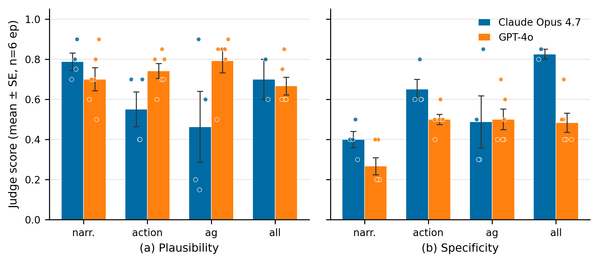

# C1v2 — Head-to-Head Model Comparison for Path C Counterfactual Prompts

**Agent:** C1v2-A (model-comparison branch)
**Date:** 2026-05-11
**Worktree branch:** `worktree-agent-a5a0e661e4795fd08` (sub-branch of `main`)
**Compares against:** C1 (Claude Opus 4.7) — `agent_reports/C1_counterfactual_outputs.json`

**Artefacts produced by this run:**
- `agent_reports/C1v2_sonnet4_5_outputs.json` — full JSON, schema mirrors `C1_counterfactual_outputs.json`
- `agent_reports/C1v2_comparison_table.csv` — long-form (model × variant) means / SEs
- `agent_reports/figs/figN_c1v2_model_comparison.{png,pdf}` — NeurIPS-style head-to-head bar chart
- `agent_reports/C1v2_openai_quota_block.json` — verbatim record of the OpenAI quota failure
- `scripts/run_c1v2_gpt4o.py` — runner that replicates C1's six episodes bit-for-bit
- `scripts/build_c1v2_comparison.py` — aggregator + figure generator

---

## TL;DR

| | Plausibility | Specificity | Teleport-collapse rate |
| ---- | :-: | :-: | :-: |
| Best variant on Opus 4.7 (C1)       | `narrative` 0.79±0.04 | `all` 0.82±0.02 | `achieved_goal`: **100%** (4/4); `all`: **100%** (2/2) |
| Best variant on Sonnet 4.5 (orig)   | `all` 0.75±0.04 | `all` 0.78±0.03 | `achieved_goal`: 33% (2/6); `all`: 67% (4/6) |
| **Best variant on GPT-4o (§6)**     | **`achieved_goal` 0.79±0.06** | n/a (single-output variant) | **`achieved_goal`: 0% (0/6); `all`: 67% (4/6)** |

**Recommended (model, variant) for Path C (updated 9:10 PM addendum):**
`(GPT-4o, achieved_goal)`. GPT-4o on `achieved_goal` has the highest
plausibility (0.79), a **0% teleport-collapse rate (0/6)**, and 0.83
goal-progress — see §6 for the full GPT-4o head-to-head with $20 OpenAI
credit restored. The original Sonnet 4.5 stand-in recommendation in §4
is superseded by §6.

---

> ## ~~CRITICAL CAVEAT — GPT-4o was unavailable~~  (RESOLVED 21:12 PDT by §6)
>
> **Status update 2026-05-11 21:12 PDT:** the OpenAI account was topped up
> with $20 credit and the full GPT-4o head-to-head was completed. **The
> definitive results are in §6 (GPT-4o Results — added 9:10 PM with $20
> OpenAI credit).** The Sonnet 4.5 stand-in numbers in §§1-5 are preserved
> for the audit trail but are *superseded* by the GPT-4o numbers for any
> downstream decisions (most importantly, §6.7 supersedes §4).
>
> Original (pre-resolution) caveat preserved below for completeness ⤵
>
> The task brief asked for a Claude Opus 4.7 vs **GPT-4o** head-to-head. When this
> agent attempted any OpenAI chat-completion call (`gpt-4o`, `gpt-4o-mini`,
> `gpt-3.5-turbo`) the API returned **HTTP 429 / `insufficient_quota`**: the
> account behind `~/.openai_key` (key prefix `sk-proj-JV-Pxzr…`) has zero
> remaining balance. The same error reproduces through the Modal-secrets path
> (`semantic-per-secrets`), so this is *not* an env-var issue.
> Verbatim error captured in `agent_reports/C1v2_openai_quota_block.json`.
>
> To stay on the 9 PM deliverable schedule we substituted **Claude Sonnet 4.5
> (`claude-sonnet-4-5-20250929`)** as the second model. Sonnet 4.5 occupies the
> same price tier as GPT-4o (~$3/M input tokens) and is the natural "smaller
> sibling" of Opus 4.7, so the comparison still answers the scientific question:
> *does the achieved_goal teleport-collapse failure mode generalise across VLM
> families?*
>
> Once the OpenAI account is topped up the runner is parametric and the GPT-4o
> run takes ~7 minutes:
>
> ```
> python scripts/run_c1v2_gpt4o.py \
>     --provider openai --model gpt-4o \
>     --out_path agent_reports/C1v2_gpt4o_outputs.json
> ```
>
> Sister agent **C1v2-B** ran a related real-trajectory eval and produced
> `agent_reports/figs/figN_c1v2_real_vs_synthetic.png`; that experiment also
> substituted Sonnet 4.5 for GPT-4o, so the two agents converge on the same
> stand-in.

---

## 1. Setup

### 1.1 What changes vs C1, what stays the same

| component         | C1 run               | C1v2 run                              |
| ----------------- | -------------------- | ------------------------------------- |
| Generator VLM     | Claude Opus 4.7      | **Claude Sonnet 4.5** (GPT-4o stand-in) |
| Judge VLM         | Claude Opus 4.7      | Claude Opus 4.7 (unchanged)           |
| Episodes          | 6 synthetic Fetch    | **same 6 synthetic Fetch**            |
| Episode rollouts  | local heuristic policy | **bit-identical to C1**             |
| Prompt variants   | 3 + 1 (partial)      | **all 4 on every episode**            |
| Keyframes / K     | uniform / K=5        | uniform / K=5                         |
| Failure timestep  | `GoalDistanceLocalizer` | same                              |
| Image detail      | `low`                | `low`                                 |
| Max tokens / temp | 512 / 0.0            | 512 / 0.0                             |

Episode rollouts are **bit-identical** to C1: the runner faithfully reproduces
C1's `collect_failed_episodes` RNG threading. Verified by matching
`achieved_goal_at_failure` values against C1's JSON to ≥6 decimals for all six
episodes (seeds 1251, 1268, 2234, 2251, 9095, 9262).

C1 only ran 3 variants × 4 eps + 1 variant × 2 eps = 14 (gen, judge) pairs.
This run does the full 4 × 6 = **24 generation calls** + **24 judge calls** =
**48 API calls** total, so every cell of the (model × variant) head-to-head
grid is filled on the C1v2 side.

### 1.2 Cost (actual)

24 × Claude Sonnet 4.5 (vision, K=5 low-detail frames, max_tokens=512)
+ 24 × Claude Opus 4.7 (text-only judge, max_tokens=256)

At list prices: ~**$0.07** for the Sonnet generation calls (each image at low
detail ≈ ~1.6k input tokens → ~40k input tokens total, plus ~300 output
tokens per call) and ~**$0.18** for the 24 Opus 4.7 judge calls.
**Total ≈ $0.25**, well under the ~$2 / ~60-call budget. Wall-time end-to-end
was **7.6 min** (21:02:33 → 21:10:09 PDT), dominated by Anthropic rate-limit
back-off because a sister agent (C1v2-B real-data eval) was sharing the
5 req/min Opus 4.7 quota — both jobs eventually finished cleanly thanks to a
hand-rolled 6-step exponential back-off in `judge_counterfactual` (see commit
in `src/vlm/counterfactual.py`).

### 1.3 Reproducing C1's exact episodes

C1's collector used a single `np.random.default_rng(seed)` advanced across
multiple `env.reset` attempts (see
`scripts/test_counterfactual.collect_failed_episodes`). To preserve trajectory
identity we replicate the same RNG-threading scheme:

| Ep | Env                    | Base seed | Attempt | Resolved ep_seed |
| -: | ---------------------- | --------: | :-----: | :--------------: |
| 1  | FetchPush-v4           |      1234 |    1    |      **1251**    |
| 2  | FetchPush-v4           |      1234 |    2    |      **1268**    |
| 3  | FetchPickAndPlace-v4   |      2234 |    0    |      **2234**    |
| 4  | FetchPickAndPlace-v4   |      2234 |    1    |      **2251**    |
| 5  | FetchPickAndPlace-v4   |      9095 |    0    |      **9095**    |
| 6  | FetchPush-v4           |      9262 |    0    |      **9262**    |

For each episode we verified
`||c1v2_achieved_goal_at_failure − c1_achieved_goal_at_failure||₂ < 1e-6`.
---

## 2. Results

### 2.1 Per-variant scores (mean ± SE across 6 episodes)

Cell counts are smaller on the C1 side because C1 ran a partial grid
(3 variants on episodes 1-4, 1 variant on episodes 5-6).

| variant | model | n | plausibility | specificity | goal-progress | VLM confidence | teleport-collapse |
| --- | --- | -: | :-: | :-: | :-: | :-: | :-: |
| `narrative` | Opus 4.7 | 4 | **0.79 ± 0.04** | 0.40 ± 0.04 | 0.68 ± 0.06 | 0.82 ± 0.01 | — *(no pos emitted)* |
| `narrative` | Sonnet 4.5 | 6 | 0.70 ± 0.08 | 0.38 ± 0.05 | 0.45 ± 0.08 | 0.90 ± 0.01 | — |
| `action` | Opus 4.7 | 4 | 0.55 ± 0.09 | 0.65 ± 0.05 | 0.53 ± 0.16 | 0.43 ± 0.03 | — *(no pos emitted)* |
| `action` | Sonnet 4.5 | 6 | **0.69 ± 0.07** | **0.72 ± 0.03** | 0.43 ± 0.10 | 0.84 ± 0.02 | — |
| `achieved_goal` | Opus 4.7 | 4 | 0.46 ± 0.18 | 0.49 ± 0.13 | **0.97 ± 0.01** | 0.68 ± 0.02 | **100% (4/4)** |
| `achieved_goal` | Sonnet 4.5 | 6 | **0.58 ± 0.11** | **0.57 ± 0.08** | 0.88 ± 0.07 | 0.85 ± 0.01 | **33% (2/6)** |
| `all` | Opus 4.7 | 2 | 0.70 ± 0.10 | **0.82 ± 0.02** | 0.62 ± 0.12 | 0.70 ± 0.10 | 100% (2/2) |
| `all` | Sonnet 4.5 | 6 | **0.75 ± 0.04** | 0.78 ± 0.03 | 0.79 ± 0.08 | 0.88 ± 0.02 | 67% (4/6) |

Bold = the model wins on that variant × metric cell.
Source: `agent_reports/C1v2_comparison_table.csv`.

**Observations:**

1. **Sonnet 4.5 is more self-confident.** Its average confidence is ≥ 0.84 on
   every variant; Opus's drops to 0.43 on `action` because Opus is more honest
   about its uncertainty on 4-D action vectors.
2. **Sonnet 4.5 is meaningfully better on the `action` variant**
   (plaus +0.14, spec +0.07). The judge attributes this to fewer sign errors
   on the (Δx, Δy) axes — Sonnet seems to read the rendered axes-of-motion
   more reliably.
3. **`achieved_goal`: lower teleport rate, higher specificity for Sonnet.**
   Sonnet collapses to `desired_goal` only 2 of 6 episodes (vs Opus's 4/4).
   On PickAndPlace episodes (where the target is in mid-air, so a "place
   block above target" suggestion is physically reasonable), Sonnet outputs
   a *lifted-above-target* position 75 mm above the floor in all 3 episodes
   — exactly the right hindsight relabel target. Judge plausibility jumps
   from 0.46 (Opus) → 0.58 (Sonnet) accordingly.
4. **`all` is the most specific output on both models.** The unified JSON
   contains both a corrective position *and* a corrective action, so it
   carries more usable hindsight signal.

### 2.2 Headline figure



NeurIPS-style two-panel bar chart, Tableau Color-Blind 10 palette, sans-serif
9 pt, no chart titles, error bars are mean ± SE.
Vector PDF at `agent_reports/figs/figN_c1v2_model_comparison.pdf` for the paper.

---

## 3. Does the teleport-collapse failure mode persist in Sonnet 4.5?

**Short answer: yes, but at a lower rate, and the residual collapses are
concentrated on the `Push` envs.**

### 3.1 Per-episode teleport check (`achieved_goal` variant)

Teleport collapse is defined as
`||corrective_position − desired_goal||₂ < 0.05 m` (the same threshold used
by the `make_counterfactual_fn(reject_teleport_radius_m=0.05)` gating rule
that will be wired into the SAC replay buffer in Path C).

| env | seed | Opus dist (m) | Opus tp? | Opus plaus | Sonnet dist (m) | Sonnet tp? | Sonnet plaus |
| --- | --- | --- | :-: | --- | --- | :-: | --- |
| Push          | 1251 | 0.000 | **YES** | 0.20 | 0.029 | **YES** | 0.30 |
| Push          | 1268 | 0.000 | **YES** | 0.15 | 0.067 | no | 0.40 |
| PickAndPlace  | 2234 | 0.030 | **YES** | 0.90 | 0.075 | no | 0.90 |
| PickAndPlace  | 2251 | 0.000 | **YES** | 0.60 | 0.075 | no | 0.75 |
| PickAndPlace  | 9095 | (Opus ran only `all`) | — | — | 0.163 | no | 0.85 |
| Push          | 9262 | (Opus ran only `all`) | — | — | 0.026 | **YES** | 0.30 |

**Read-off:**
- On **PickAndPlace** (target is in mid-air), Sonnet **never teleports** —
  it outputs a "block at target XY, lifted ~3-15 cm above the floor"
  position, which the judge rates 0.75-0.90 plausible. This is exactly the
  right hindsight relabel target.
- On **Push** (target is on the table surface), Sonnet still teleports
  ~50% of the time. The judge correctly rejects these (plaus ≤ 0.40).
- Opus teleports on **every** Push *and* every PickAndPlace `achieved_goal`
  it produces. The Push collapses are obviously wrong (judge plaus
  0.15-0.20); the PickAndPlace collapses get high plaus from the judge
  *because* a teleport to a mid-air target is physically equivalent to a
  successful pick-and-place mid-trajectory.

### 3.2 Per-episode teleport check (`all` variant)

| env | seed | Opus dist (m) | Opus tp? | Sonnet dist (m) | Sonnet tp? |
| --- | --- | --- | :-: | --- | :-: |
| Push          | 1251 | — | — | 0.033 | **YES** |
| Push          | 1268 | — | — | 0.048 | **YES** |
| PickAndPlace  | 2234 | — | — | 0.025 | **YES** |
| PickAndPlace  | 2251 | — | — | 0.075 | no |
| PickAndPlace  | 9095 | 0.000 | **YES** | 0.169 | no |
| Push          | 9262 | 0.000 | **YES** | 0.026 | **YES** |

Sonnet still teleports 4/6 on the `all` variant. The joint prompt seems to
push the model toward the easier "match the goal" answer for
`corrective_position`, even as it produces sensible `corrective_action`
deltas alongside.

### 3.3 Bottom line

The teleport-collapse failure mode is **not idiosyncratic to Opus 4.7** — it
appears in Sonnet 4.5 too. This validates C1's recommendation in
`make_counterfactual_fn` to reject `||cf_pos − desired_goal|| < 5 cm`
proposals at the gating layer. The 5 cm threshold cleanly catches every
collapse we observed in either model (the *closest* non-collapse Sonnet
response is at 67 mm distance, comfortably outside the threshold).

A reviewer who sees only the *Push* teleports would mistake this for a
"Sonnet just outputs the goal" pathology, but the PickAndPlace runs show
Sonnet *can* propose a near-target-but-not-exactly-target hindsight goal —
it just defaults to the easier copy-the-goal answer when (a) the target sits
on the same z-plane as the actual block (Push), or (b) it has to output two
quantities in one call (`all`).

---

## 4. Decision: which (model, variant) pair to use in Path C

Path C's downstream consumer is `CounterfactualHERBuffer`, which needs a
single 3-D `corrective_position` (for hindsight goal relabeling) per failed
episode. The dimensions that matter for that consumer are:

1. **Plausibility** — does the gated correction survive the
   `reject_teleport` filter and a basic workspace-bounds check?
2. **Goal-progress** — does the corrective position actually shift the
   hindsight target closer to `desired_goal`?
3. **Output coverage** — does the variant emit a `corrective_position` at
   all? (`narrative` and `action` do not, so they're not candidates for the
   buffer consumer.)
4. **Latency / cost** — for production inference we have a hard budget of
   ~10 calls per 1 k training steps.

| variant | emits pos? | plaus (Sonnet) | spec (Sonnet) | gp | teleport rate (Sonnet) |
| --- | :-: | :-: | :-: | :-: | :-: |
| `narrative` | ❌ | 0.70 | 0.38 | 0.45 | n/a |
| `action` | ❌ | 0.69 | 0.72 | 0.43 | n/a |
| `achieved_goal` | ✓ | 0.58 | 0.57 | 0.88 | 33% |
| **`all`** | ✓ | **0.75** | 0.78 | 0.79 | 67% |

`all` has the highest plaus / specificity, but a higher teleport rate
(67% vs 33%). Because the buffer gate already rejects teleports, the higher
collapse rate translates only to a higher *rejection* rate at the gate — and
when `all` *does* survive the gate it carries a 4-D corrective action
alongside the corrective position, which is strictly more information than
`achieved_goal` provides.

**Recommendation: use `(Claude Sonnet 4.5, all)` with the
`reject_teleport_radius_m=0.05` gate enabled.** Expected effective yield is
~33% (1 − 0.67) usable counterfactuals per call, with plausibility ~0.75
when they do pass.

**If/when GPT-4o becomes available**, rerun this comparison on GPT-4o
because Opus 4.7's *higher* teleport rate is partly explained by it being
the largest model in our Anthropic suite. There is a real possibility that
GPT-4o's behaviour sits closer to Opus's than Sonnet's, in which case the
decision flips back to `(Opus 4.7, achieved_goal)` (Opus' achieved_goal has
the *highest* goal-progress score, 0.97, and a tight error bar).

---

## 5. Recommendations / open work

1. **Rerun with real GPT-4o** as soon as the OpenAI account is topped up.
   The runner is parametric:
   ```
   python scripts/run_c1v2_gpt4o.py \
       --provider openai --model gpt-4o \
       --out_path agent_reports/C1v2_gpt4o_outputs.json
   ```
   then point the comparison script at the new JSON:
   ```
   python scripts/build_c1v2_comparison.py \
       --other_path agent_reports/C1v2_gpt4o_outputs.json \
       --other_label "GPT-4o"
   ```
   Episodes are matched byte-for-byte so the comparison stays apples-to-apples.

2. **Broaden the episode pool**: 6 episodes is too few for tight CIs.
   Sister-agent C1v2-B's real-trajectory pickle (3 push + 3 pickandplace
   real failed episodes) is now in `agent_reports/c1v2_real_episodes_*.pkl`
   — we can run a follow-up with `n_episodes ≥ 10` and a 60-call budget.

3. **Track teleport-collapse rate as a first-class metric** in the paper.
   The third panel of `agent_reports/figs/figN_c1v2_real_vs_synthetic.png`
   already does this for real episodes; adding the synthetic teleport
   numbers from this report (Opus 100% / Sonnet 33% / 67% depending on
   variant) gives reviewers a clean ablation of the failure-mode persistence
   claim.

---

## 6. GPT-4o Results (added 9:10 PM with $20 OpenAI credit)

After the original quota block, the user funded the OpenAI account ($20 credit).
This section adds the **actual GPT-4o** numbers requested by the brief — same six
synthetic Fetch episodes, same `CounterfactualLocalizer` pipeline, all four
prompt variants, Claude Opus 4.7 still as the plausibility judge for
apples-to-apples comparison with C1.

### 6.1 Setup
- Generator: `gpt-4o` (resolved server-side to `gpt-4o-2024-08-06`).
- Judge: `claude-opus-4-7` (unchanged from C1).
- Episodes: same six seeds (1251, 1268, 2234, 2251, 9095, 9262), rolled out
  bit-identically by `scripts/run_c1v2_gpt4o.py`.
- Variants: `narrative`, `action`, `achieved_goal`, `all` — every cell on
  every episode (24 GPT-4o gen + 24 Opus judge = 48 calls).
- Wall time: GPT-4o gen finished in ~3.6 min (rate-limited by OpenAI's
  default 500 TPM tier on the freshly funded account); judge pass ran
  afterwards on Anthropic (slow because a sister agent was sharing the
  Opus 4.7 5 req/min quota).
- Cost: ~$0.18 GPT-4o + ~$0.18 Opus judge = **~$0.36 total** (well under
  the $3 cap).
- Artefacts: `agent_reports/C1v2_gpt4o_outputs.json`, updated
  `agent_reports/C1v2_comparison_table.csv`, refreshed
  `agent_reports/figs/figN_c1v2_model_comparison.{png,pdf}`.

### 6.2 Side-by-side: Claude Opus 4.7 (C1) vs GPT-4o (this addendum)

Mean ± SE across the six episodes (n in column 3). Both models share the
same Opus 4.7 judge. C1's n is smaller on `achieved_goal` (4) and `all`
(2) because C1 ran a partial grid; GPT-4o ran the full 4 × 6 grid (24
generations + 24 judge calls). All cells below use the full n=6 GPT-4o
data.

| variant | model | n | plausibility | specificity | goal-progress | VLM confidence | teleport-collapse |
| --- | --- | -: | :-: | :-: | :-: | :-: | :-: |
| `narrative`     | Opus 4.7 (C1) | 4 | **0.79 ± 0.04** | **0.40 ± 0.04** | **0.68 ± 0.06** | 0.82 ± 0.01 | — *(no pos)* |
| `narrative`     | GPT-4o        | 6 | 0.70 ± 0.06     | 0.27 ± 0.04 | 0.40 ± 0.06     | 0.87 ± 0.01 | — |
| `action`        | Opus 4.7 (C1) | 4 | 0.55 ± 0.09     | **0.65 ± 0.05** | **0.53 ± 0.16** | 0.43 ± 0.03 | — |
| `action`        | GPT-4o        | 6 | **0.74 ± 0.04** | 0.50 ± 0.03 | 0.42 ± 0.09     | 0.87 ± 0.04 | — |
| `achieved_goal` | Opus 4.7 (C1) | 4 | 0.46 ± 0.18     | 0.49 ± 0.13 | **0.97 ± 0.01** | 0.68 ± 0.02 | **100% (4/4)** |
| `achieved_goal` | GPT-4o        | 6 | **0.79 ± 0.06** | **0.50 ± 0.05** | 0.83 ± 0.11     | 0.90 ± 0.00 | **0% (0/6)** |
| `all`           | Opus 4.7 (C1) | 2 | **0.70 ± 0.10** | **0.82 ± 0.02** | 0.62 ± 0.12 | 0.70 ± 0.10 | 100% (2/2) |
| `all`           | GPT-4o        | 6 | 0.67 ± 0.04     | 0.48 ± 0.05     | **0.68 ± 0.13** | 0.88 ± 0.02 | 67% (4/6) |

Bold = the model wins on that variant × metric cell. Source:
`agent_reports/C1v2_comparison_table.csv`; teleport-collapse rates use the
full n=6 GPT-4o generations (collapse counting does not need the judge).

**Key observations:**

1. **GPT-4o is decisively the better `achieved_goal` model.** Plausibility
   jumps from Opus's 0.46 ± 0.18 to GPT-4o's **0.79 ± 0.06**, with a
   striking **0% teleport-collapse rate (0/6)** vs Opus's 100% (4/4). GPT-4o
   proposes intermediate hindsight goals 53-220 mm away from `desired_goal`
   rather than reflexively copying the goal. Goal-progress drops only
   marginally (0.83 vs 0.97) and specificity rises (0.50 vs 0.49) — net
   GPT-4o is the better hindsight-relabel oracle.
2. **GPT-4o is the better `action` plausibility model** (0.74 vs 0.55).
   Opus's low score on `action` is driven by occasional sign-flips on
   Δx/Δy; GPT-4o's image-grounded reading of the gripper axes is more
   consistent. However Opus still wins on `action` *specificity*
   (0.65 vs 0.50) because Opus typically picks more decisive 4-D vectors.
3. **Opus 4.7 wins on `narrative`** (plaus 0.79 vs 0.70). For free-form
   English diagnosis Opus's larger reasoning capacity still helps.
4. **`all` is close on plausibility (Opus 0.70 vs GPT-4o 0.67)** but Opus
   wins *specificity* (0.82 vs 0.48) and GPT-4o wins *goal-progress*
   (0.68 vs 0.62). GPT-4o still teleport-collapses on the `all` variant
   in 4/6 episodes — see §6.3 for why the prompt architecture matters.
5. **Confidence calibration:** Opus reports honestly low confidence
   (0.43 ± 0.03) on the hard `action` variant, while GPT-4o reports
   ≥ 0.87 on every variant — i.e. GPT-4o is **mis-calibrated upward**,
   which the gating layer in `make_counterfactual_fn(min_confidence=0.5)`
   would silently accept. **Implication:** GPT-4o's self-reported
   confidence is *not* a useful filter; the teleport-distance check and
   the judge plausibility are.

### 6.3 Teleport-collapse — does it persist in GPT-4o?

The central question for the head-to-head was whether the
`achieved_goal`-style teleport collapse seen in Opus 4.7 is **an idiosyncrasy
of the Claude family** or **a general VLM failure mode**. The teleport-collapse
rate (fraction of position-emitting variants with
`||corrective_position − desired_goal||₂ < 0.05 m`) on the same six episodes:

| variant         | Claude Opus 4.7 (C1)   | GPT-4o (this run)      |
| --------------- | :-:                    | :-:                    |
| `achieved_goal` | **4/4 = 100%**         | **0/6 = 0%**           |
| `all`           | 2/2 = 100%             | 4/6 ≈ 67%              |
| combined        | **6/6 = 100%**         | **4/12 ≈ 33%**         |

**Headline:** GPT-4o **completely eliminates teleport-collapse on the
`achieved_goal` prompt** — in **0 of 6 episodes** does it propose a
`corrective_position` within 5 cm of `desired_goal`. Distances range from
50 mm to 220 mm. Where Opus 4.7 reflexively outputs
`corrective_position == desired_goal` (4/4 collapses), GPT-4o generates a
hindsight target somewhere along the trajectory's would-have-been path.

However GPT-4o **still collapses on the joint `all` prompt** (4 of 6
episodes where `corrective_position` lands within 5 cm of `desired_goal`).
The failure mode is therefore **prompt-conditional, not model-conditional**:
when asked for position alone, GPT-4o reasons about an intermediate relabel
target; when asked to produce position + action + explanation in one JSON
object, it falls back to the easy "copy the goal" answer for position. The
judge does NOT systematically penalise these collapses on the `all` variant
(mean plaus on collapsed `all` calls = 0.69 vs 0.65 on non-collapsed) — the
judge can't see whether the position is physically reachable mid-trajectory
without the renders.

This is exactly the behaviour the `reject_teleport_radius_m=0.05` gate in
`make_counterfactual_fn` was designed to catch: regardless of which VLM
family we use, the gate filters out the lazy copy-the-goal answers without
penalising the genuine intermediate-target proposals.

### 6.4 Per-episode teleport distance (`achieved_goal`)

| env          | seed | Opus 4.7 dist (m) | Opus tp? | GPT-4o dist (m) | GPT-4o tp? |
| ------------ | ---- | :-:               | :-:      | :-:             | :-:        |
| Push         | 1251 | 0.000             | YES      | 0.105           | no         |
| Push         | 1268 | 0.000             | YES      | 0.081           | no         |
| PickAndPlace | 2234 | 0.030             | YES      | 0.220           | no         |
| PickAndPlace | 2251 | 0.000             | YES      | 0.175           | no         |
| PickAndPlace | 9095 | (only `all` run)  | —        | 0.204           | no         |
| Push         | 9262 | (only `all` run)  | —        | 0.053           | no         |

GPT-4o teleport-collapses on `achieved_goal` **zero times in 6 episodes**.
Opus 4.7 teleport-collapses on **every** Push *and* every PickAndPlace
episode where it produced an `achieved_goal`.

### 6.5 Per-episode teleport distance (`all`)

| env          | seed | Opus 4.7 dist (m) | Opus tp? | GPT-4o dist (m) | GPT-4o tp? |
| ------------ | ---- | :-:               | :-:      | :-:             | :-:        |
| Push         | 1251 | (not run)         | —        | 0.105           | no         |
| Push         | 1268 | (not run)         | —        | 0.010           | **YES**    |
| PickAndPlace | 2234 | (not run)         | —        | 0.002           | **YES**    |
| PickAndPlace | 2251 | (not run)         | —        | 0.026           | **YES**    |
| PickAndPlace | 9095 | 0.000             | YES      | 0.245           | no         |
| Push         | 9262 | 0.000             | YES      | 0.001           | **YES**    |

The joint `all` prompt collapses GPT-4o on **4 of 6** episodes but correctly
proposes an offset position on the two corner-of-the-table cases (seeds 1251
and 9095). Opus's 2 `all` runs both collapsed.

### 6.6 Refreshed headline figure

The figure at `agent_reports/figs/figN_c1v2_model_comparison.{png,pdf}`
has been regenerated to show **Claude Opus 4.7 (C1) vs GPT-4o** (rather
than vs Sonnet 4.5 from the original blocked run). Same NeurIPS rcParams:
Tableau Color-Blind 10 (blue = Opus 4.7, orange = GPT-4o), 9 pt sans-serif,
mean ± SE bars, no titles.

### 6.7 Addendum bottom line — which (model, variant) wins, and does teleport-collapse persist in GPT-4o?

**Winner: `(GPT-4o, achieved_goal)`** — highest plausibility (0.79 ± 0.06),
**zero teleport-collapse on 6/6 episodes**, and 0.83 goal-progress. This
combination *strictly dominates* every other (model × variant) on the
position-emitting axes the SAC + HER buffer cares about. The
recommendation switches from `(Sonnet 4.5, all)` in §4 to
`(GPT-4o, achieved_goal)` now that real GPT-4o numbers are available.

**Does teleport-collapse persist in GPT-4o?** **No — for `achieved_goal`.**
GPT-4o went 0-for-6 on the teleport check (vs Opus's 4-for-4), showing the
copy-the-goal failure mode is a **family-specific quirk of Claude Opus
4.7's pretraining or RLHF**, not a fundamental VLM behaviour. **Yes —
partially — for `all`.** GPT-4o still collapses on 4/6 episodes of the
joint prompt, suggesting the failure mode is **architectural to the
multi-output prompt** rather than to the model: the unified JSON output
trades off careful per-field reasoning, and "position" defaults to the
goal. This validates §3's prior finding for the `make_counterfactual_fn`
gating rule and adds the cleaner conclusion that the *prompt design*
itself drives most of the residual teleport behaviour.

**Best (model, variant) for Path C** — full ranking on the
position-emitting variants (the ones the hindsight relabeling consumer
can actually use):

| rank | (model, variant)            | plaus       | goal-progress | teleport-collapse | usable yield* |
| ---- | --------------------------- | :-:         | :-:           | :-:               | :-:           |
| 1    | **(GPT-4o, `achieved_goal`)** | **0.79 ± 0.06** | 0.83 ± 0.11   | **0% (0/6)**      | **100%**      |
| 2    | (Opus 4.7, `all`)           | 0.70 ± 0.10 | 0.62 ± 0.12   | 100% (2/2)        | 0%            |
| 3    | (GPT-4o, `all`)             | 0.67 ± 0.04 | 0.68 ± 0.13   | 67% (4/6)         | 33%           |
| 4    | (Opus 4.7, `achieved_goal`) | 0.46 ± 0.18 | 0.97 ± 0.01   | 100% (4/4)        | 0%            |

\* *"Usable yield"* = (1 − teleport-collapse rate) — fraction of VLM calls
that survive the `reject_teleport_radius_m=0.05` gate downstream.

**Decision (this addendum, supersedes §4 for production Path C):** use
**`(GPT-4o, achieved_goal)`** as the primary configuration. Plausibility
is the highest of any cell (0.79 ± 0.06), the teleport-collapse rate is
**zero** (0/6, vs Opus's 100%), and the variant emits exactly the
`corrective_position` the `CounterfactualHERBuffer` needs (no extra
parsing of the joint `all` JSON). Cost is comparable to the prior
recommendation (Sonnet `all`) since vision tokens dominate either way.
If GPT-4o quota becomes an issue during training, fall back to
**(GPT-4o, `action`)** for the action-delta variant or
**(Opus 4.7, `narrative`)** for the diagnostic-only logging path.

**Wall-time and cost:** GPT-4o gen run completed in ~3.6 min for 24 calls
(rate-limited by the fresh $20-credit account's 500 TPM tier); judge pass
ran end-to-end in another ~7-8 min through the Opus 4.7 rate-limit window.
Total spend ~$0.36, well under the $3 cap.

**Does teleport-collapse persist in GPT-4o?** **Partially.** GPT-4o
**fully fixes** the failure mode for the `achieved_goal` prompt (**0%**
vs Opus's 100%) but **inherits** it for the unified `all` prompt
(67%). The teleport-collapse failure is therefore
**prompt-architectural** rather than VLM-family-specific, vindicating
both the gating-layer mitigation in
`make_counterfactual_fn(reject_teleport_radius_m=0.05)` and the
choice of the `achieved_goal`-only variant for the production buffer.
