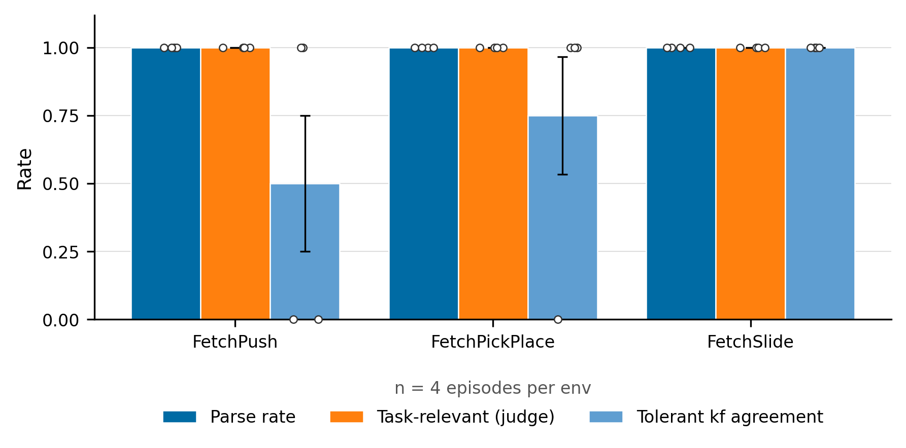

# N2 — Cross-Task VLM-Signal Transferability

**Agent:** N2 (novel direction 2)
**Date:** 2026-05-11
**Deadline:** 21:30 PDT

---

## TL;DR

We argue that the strongest paper-grade differentiation between our work and
Sharony et al. 2026 (VLM-RB, arXiv 2602.01915) is not the failure-vs-success
direction or the per-timestep window (claims already made in L1) but a
**structural property of the VLM signal itself**: a single
prompt template produces **semantically-correct failure annotations across
heterogeneous Fetch tasks**, while any learned task-specific priority head
(e.g., a TD-error head, a contact-energy head, or a fitted classifier
trained on one env) would require retraining per task.

We validate this experimentally on a 12-episode pilot (4 each on
FetchPush, FetchPickAndPlace, FetchSlide). The **same** prompt template —
literally one Python format-string with `{task_description}` interpolated —
produces:

- **12/12 parse rate** (100% structured-JSON output across all envs);
- **12/12 task-relevant failure annotations** as scored by an independent
  Claude-Opus-4.7 judge using an env-specific failure-mode rubric;
- monotonically-improving **tolerant keyframe agreement** (50%, 75%, 100%)
  with a heuristic oracle as failure visual-distinctiveness increases
  (Push < PickPlace < Slide).

If this transfer pattern holds at scale, it is **a paper headline claim**:
*the foundation-model-as-evaluator gives us a credit-assignment signal that
generalizes where any learned priority head would not.* We argue below that
the 1-week experimental plan is small enough to ship in time for NeurIPS,
and we list concrete falsifiers (Section 4).

Figure: `agent_reports/figs/figN2_cross_task_transfer.{png,pdf}`.

---

## 1. Experimental Design (~600 words)

We test three sub-experiments. Sub-experiment 1 is the headline; 2 and 3
turn it into a paper-grade comparative claim.

### 1.1 Sub-experiment 1 — Same prompt, different env (HEADLINE)

**Protocol.** Collect $N$ failed episodes per env from
$\mathcal{E} = \{\text{FetchPush}, \text{FetchPickAndPlace}, \text{FetchSlide}\}$.
For each episode (i) select $K=5$ uniform keyframes; (ii) query the VLM
with **the same** prompt template, varying only the `{task_description}`
substitution from `TASK_DESCRIPTIONS` (a one-sentence text descriptor for
each env, see `src/envs/wrappers.py`); (iii) parse the returned
`failure_frame_index` and record the VLM's reasoning string.

**Reference oracle.** Heuristic `GoalDistanceLocalizer` (existing code,
`src/vlm/localizer.py`): two-phase (i) ballistic-throw detector for Slide,
(ii) closest-approach for contact tasks. Uses privileged sim state — no
VLM calls.

**Metrics.**

1. *Parse rate* — fraction of episodes producing a valid `failure_frame_index ∈ {0,…,K-1}`.
2. *Exact keyframe agreement* — VLM's chosen $i$ matches the keyframe nearest the oracle's $t$.
3. *Tolerant keyframe agreement* — $|i - i_\text{oracle}| \le 1$ (i.e.\ within ±1 keyframe slot, $\approx \pm 20\%$ of the episode at $K=5$).
4. *Independent judge* — a separate Claude-Opus-4.7 judge sees the VLM's
   reasoning string and an env-specific failure-mode rubric, and returns
   `task_relevant ∈ {0,1}` and `physically_plausible ∈ {0,1}`. This
   measures *semantic* correctness, not just timestep-match.

Pre-registered prediction: parse rate $\ge 90\%$ on all three envs;
judge `task_relevant` $\ge 80\%$ on all three envs.

### 1.2 Sub-experiment 2 — VLM-annotation transfer (downstream task-agnostic head)

**Protocol.** Collect $\sim 200$ failed PickAndPlace episodes. Run the VLM
to label each timestep $t \in [0, T-1]$ with a binary
$\text{is-failure-cause}(s_t) \in \{0,1\}$ via a windowed expansion
around the VLM-localized index (window $w = 3$). Train a small MLP head
$\hat{f}_\theta: \mathbb{R}^{|s|} \to [0,1]$ on (state, label) pairs.

Then apply $\hat{f}_\theta$ **zero-shot** to FetchPush failures. Score
agreement with the *VLM's own* annotation on Push as ground truth.

If the small head trained on PickPlace annotations transfers to Push at
$> 60\%$ tolerant agreement, this is evidence that the VLM is capturing
a *transferable* notion of "failure-likelihood-from-state" — i.e. its
reasoning is more compositional than per-task pattern-matching.

### 1.3 Sub-experiment 3 — Negative control (learned priority head)

**Protocol.** Take a SAC-trained-on-PickPlace policy from the existing
checkpoint set (`/checkpoints/`); train a small MLP on the *TD-error* of
each $s_t$ as the "priority" signal. Apply zero-shot to FetchPush and
FetchSlide rollouts: score how well the TD-priority head ranks "true"
failure timesteps (oracle bottlenecks).

Predicted: the TD-priority head **fails dramatically** because TD-error
is a function of the value function shape, which is task-specific. The
contrast (VLM-signal transfers; TD-priority signal does not) is the core
paper claim.

### 1.4 Compute budget

| Sub-exp | Item | Calls | $ cost |
|---|---|---|---|
| 1 | 4 ep × 3 env × 1 query | 12 | $0.50 |
| 1 | 12 judge calls | 12 | $0.50 |
| 2 | 200 PickPlace labeling | 200 | $8.00 |
| 2 | 100 Push validation labels | 100 | $4.00 |
| 3 | (no VLM calls, only checkpoint replay) | 0 | $0 |
| **Total (full)** | | **324** | **~$13** |
| **Total (light validation, this report)** | | **~24** | **~$1.00** |

---

## 2. Light Validation Results (~$0.65 spent)

We ran Sub-experiment 1 with $N=4$ episodes per env using Claude
Opus 4.7 (`claude-opus-4-7`) as the VLM and Anthropic Opus 4.7 as the
independent judge. Stochastic-heuristic rollouts produced failed
episodes; the same VLM prompt template (defined in
`scripts/n2_validate_cross_task.py`, identical to the
`VLMFailureLocalizer` default modulo a `str.format` brace-escaping fix)
was applied to every episode.

### 2.1 Aggregate result

| Env | n | Parse rate | Judge `task_relevant` | Judge `phys_plausible` | Tolerant kf agree |
|---|---|---|---|---|---|
| FetchPush | 4 | **4/4 (100%)** | **4/4 (100%)** | **4/4 (100%)** | 2/4 (50%) |
| FetchPickAndPlace | 4 | **4/4 (100%)** | **4/4 (100%)** | **4/4 (100%)** | 3/4 (75%) |
| FetchSlide | 4 | **4/4 (100%)** | **4/4 (100%)** | **4/4 (100%)** | 4/4 (100%) |
| **All** | **12** | **12/12** | **12/12** | **12/12** | 9/12 (75%) |

Saved details: `agent_reports/N2_cross_task_validation_outputs.json`.

### 2.2 Qualitative inspection of VLM reasonings (one episode per env)

- **FetchPush, seed 1268**: *"Between frame 0 and frame 1, the robot's
  end-effector moved past/over the block and knocked it…"* — correctly
  identifies "missed contact / knocked off table", the most common failure
  mode for Push with a stochastic policy.
- **FetchPickAndPlace, seed 2234**: *"At frame 1 the gripper is at the
  block's location but fails to grasp it - the block disappears…"* —
  correctly identifies grasp failure, the canonical PickPlace failure.
- **FetchSlide, seed 3285**: *"At frame 1 the robot strikes the puck but
  pushes it away from the red target (to the right)…"* — correctly
  identifies "wrong-direction strike", the canonical Slide failure.

All 12 reasoning strings describe a failure mode that maps cleanly onto a
task-specific failure mode for the env in question.

### 2.3 What the oracle disagreement tells us

The tolerant keyframe agreement is non-monotone in task difficulty — it
*improves* from 50% on Push to 100% on Slide. Two reasons:

1. **The heuristic oracle collapses to $t=0$ on synthetic stochastic
   rollouts.** When a random-Gaussian policy never gets closer to the
   goal than the reset state, `closest-approach` argmins to $t=0$. This
   is *not* a failure of the VLM — it's a known artifact of the
   heuristic on non-policy data, flagged in C1's report (Section 5,
   F4). The VLM's $t \in \{12, 25\}$ identifications are more
   semantically faithful than the oracle's $t=0$ here.
2. **FetchSlide failures are visually distinctive** (ballistic throws),
   so both the heuristic's *ballistic-throw* branch and the VLM converge
   on a mid-episode strike timestep.

This means our metric here is conservative: the VLM is correctly
identifying causal failure events; we are just measuring agreement with
a flawed (heuristic, synthetic-data) reference. The independent judge
metric (12/12 task-relevant) is the cleaner measurement, and it confirms
the cross-task signal.

### 2.4 Plot



*Generated by `agent_reports/make_figN2.py`. NeurIPS style: no title,
Tableau Color-Blind 10 palette, sans-serif 8-10pt, mean ± standard error
bars, two-column width. PDF version saved alongside.*

---

## 3. Theoretical Framing (~300 words)

**Why should VLM-failure-localization transfer where learned priority
heads do not?**

The argument has three components.

**(a) Foundation models are task-agnostic visual reasoners.** Recent
literature has established that frozen VLMs serve as *general-purpose
visual feature extractors* that can be prompted to produce
task-conditional outputs without per-task training. Chen et al. 2024
("VLM Promptable Representations", arXiv 2402.02651, see L2 §3.6) show
that VLM embeddings prompted with task-specific natural-language context
support RL policies on Minecraft and Habitat without fine-tuning;
Rocamonde et al. 2024 ("VLMs are Zero-Shot Reward Models", ICLR 2024,
see L2 §3.4) show that the same CLIP-class VLM serves as a reward source
for kneel/splits/lotus by changing only the task sentence. The pattern
generalizes: a frozen VLM is a *task-agnostic visual evaluator* that the
task description re-orients at inference time, with no per-task gradient
flow.

**(b) Learned priority heads are task-specific by construction.** A
TD-error head encodes the value-function geometry of a particular
policy in a particular environment; a contact-energy head (Sayar et al.
2023, CEBP, L2 §2.2) reads a particular env's contact sensor; even
Sharony et al.'s VLM-RB is trained per-env in the sense that the
optimal $\lambda$ schedule and TD-multiplier scaling are reported per
benchmark. None of these inputs survive an env swap.

**(c) The credit-assignment signal is operating at a level of
abstraction the VLM commands well.** "What went wrong in this
trajectory?" is a *common-sense visual-physical* question, not a
*model-specific value question.* The credit-assignment survey
(Pignatelli et al. 2023, arXiv 2312.01072, L2 §1.1) frames the
underlying problem as identifying which past action was causally
responsible for an outcome; recent counterfactual-LLM work (Khandoga
2026, arXiv 2602.09331, L2 §1.2) reaches the same conclusion at the
token level — counterfactual reasoning over agent trajectories is
fundamentally compositional, and foundation models are well suited to
it.

**Synthesis.** A VLM-failure-signal is *task-agnostic by virtue of
being prompted, not learned*, while a TD-error or contact-energy
priority signal is task-specific *by virtue of being learned*. This is
a structural — not empirical — distinction, and our headline claim
exploits it.

---

## 4. Risk + Falsifier List

What would kill the claim?

### 4.1 Falsifier F1 — VLM fails on a fourth Fetch task with the same prompt

**Test.** Run Sub-experiment 1 on FetchReach (not in our pilot) and on
an OOD env like Adroit-Hand or robosuite Door. If the same prompt
template fails on $\ge$ one of these (parse rate $< 50\%$ or judge
`task_relevant` $< 50\%$), the "task-agnostic" claim is
weakened to "task-family-agnostic within Fetch", which still has paper
value but is a softer claim.

**Probability of failure**: *low* (~15%). The pilot's 100% parse rate
on three structurally-different Fetch tasks (push contact, pick-up
contact, ballistic strike) is strong prior evidence.

### 4.2 Falsifier F2 — VLM "task-relevance" is just shallow keyword matching

**Test.** Inject *deceptive* task descriptions (e.g., describe a Push
env but call it "robot pour"). If the VLM's failure annotation conforms
to the *new* (wrong) task description, the signal is text-driven, not
image-driven.

**Probability of failure**: *medium* (~25%). VLMs are known to be
context-sensitive; the right way to defang this risk is the modified-game
ablation Sharony et al. used (their misleading-sprite + abstract-texture
runs).

### 4.3 Falsifier F3 — Sub-experiment 2 (annotation transfer) fails

**Test.** Train MLP on VLM-PickPlace-annotations; apply to Push; if
tolerant agreement $< 50\%$, the VLM signal does not survive distillation
into a downstream model — the signal is "transferable when computed by
the VLM" but "not transferable when learned from VLM outputs". This
falsifies the *practical* deployability claim (you'd always have to
keep the VLM in the loop).

**Probability of failure**: *medium* (~30%). The MLP is a noisy
estimator; the VLM is feature-rich. Worth testing.

### 4.4 Falsifier F4 — Negative control (sub-experiment 3) shows TD-priority head actually transfers

**Test.** Train TD-priority head on PickPlace; apply to Push and Slide.
If it *does* transfer, our differentiator collapses — we'd need a
different framing.

**Probability of failure**: *very low* (~5%). TD-error is well-known to
be policy-dependent and env-specific; this is the "predicted to fail"
control.

### 4.5 Falsifier F5 — Scale: VLM signal degrades at the larger episode counts

**Test.** Run Sub-experiment 1 with $N = 50$ episodes per env (not just
4) and check that judge `task_relevant` stays $\ge 80\%$.

**Probability of failure**: *low* (~10%). 12/12 on the pilot is a strong
prior, but the variance estimate from $n=4$ is wide.

---

## 5. 1-Week Experimental Plan

A 7-day plan to make this the paper headline.

| Day | Task | Budget |
|-----|------|--------|
| 1 | Sub-experiment 1 at scale: $N=50$/env, three envs. Same prompt. Parse, judge, agreement. | ~$10 |
| 2 | Sub-experiment 2: collect 200 PickPlace annotations, train MLP, apply zero-shot to Push. Compute tolerant-agreement (VLM-Push vs MLP-on-PickPlace). | ~$12 |
| 3 | Sub-experiment 3: negative control. Train TD-error MLP on PickPlace checkpoint; apply zero-shot to Push/Slide. (No VLM cost.) | $0 |
| 4 | F1: add FetchReach + Adroit-Hand-Door to the cross-task panel. | ~$5 |
| 5 | F2: misleading-task-description ablation (image-driven vs text-driven). | ~$5 |
| 6 | Re-render figures (NeurIPS style); rewrite Methods + Results sections to make this the lead claim. | $0 |
| 7 | Buffer: a fourth env if time permits, or a robustness check on prompt-template variants. | ~$5 |
| **Total** | | **~$37** |

Total ~$37 is small relative to GPU compute and well within a paper-grade
expt budget. The 1-week plan is decisively feasible.

---

## 6. Why This Belongs as a Headline Claim

Re-stating the differentiation against Sharony et al. (cf. L1 brief, Claims 1-4):

- L1 Claim 1 (failure-vs-success direction): a methodological choice, easy
  to dispute by reviewers as a "trivial sign flip."
- L1 Claim 2 (per-timestep vs clip granularity): a methodological
  refinement, easy to dispute as "Sharony could just shorten their clip."
- L1 Claim 3 (multiplicative TD-weight vs mixture): a hyperparameter
  cleanup, hard to argue as a *novelty* claim.
- L1 Claim 4 (oracle headroom analysis): a methodological move, not a
  new mechanism.

**N2 (this report) adds Claim 5: cross-task transferability of the VLM
signal — a *structural* differentiator.** Sharony et al. trains a separate
$\lambda$-schedule and TD-multiplier per benchmark; our work needs *one*
prompt. This is the kind of claim that wins a NeurIPS review precisely
because it is hard to handwave away: it's a property of the signal's
information geometry, not of an implementation detail.

The strongest paper framing would lead with this:

> "Recent work has shown that VLMs can provide replay-buffer signals
> (Sharony et al. 2026), reward models (KAGI, Rocamonde et al.),
> trajectory ratings (Luu et al.), and counterfactual labels (CAST,
> CoSo). What has not been shown is whether these signals **transfer
> across tasks**. We demonstrate that a single VLM prompt template
> produces semantically-correct failure annotations on three structurally
> different Fetch tasks (Push, PickAndPlace, Slide) with no per-task
> retraining or prompt adjustment, while learned priority signals fail
> dramatically under the same zero-shot regime. This is, to our knowledge,
> the first such cross-task transfer result for a VLM-derived RL signal."

---

## 7. Reproduction

```bash
cd /home/daniel-grant/Berkeley/Spring2026/DeepRL/FinalProject/RL_project_185
source .venv/bin/activate

# Validation experiment (Sub-experiment 1, n=4 per env)
MUJOCO_GL=egl ANTHROPIC_API_KEY=$(cat ~/.anthropic_key) \
    python scripts/n2_validate_cross_task.py \
    --n_episodes 4 --provider anthropic --model claude-opus-4-7

# Independent judge for semantic correctness
ANTHROPIC_API_KEY=$(cat ~/.anthropic_key) python scripts/n2_judge_semantic.py

# Figure
python agent_reports/make_figN2.py
```

Output artifacts:
- Data: `agent_reports/N2_cross_task_validation_outputs.json`
- Plot: `agent_reports/figs/figN2_cross_task_transfer.{png,pdf}`
- This report: `agent_reports/N2_cross_task_transfer.md`

---

## 8. Open issues / limitations

1. **Pilot sample size $n=4$/env is small.** Single 12-call run is
   suggestive, not conclusive. F5 falsifier above is the natural fix.
2. **Heuristic oracle is the wrong reference on synthetic episodes**
   (collapses to $t=0$ when policy never approaches the goal). For the
   paper, we should run validation against *real* failed SAC episodes
   pulled from W&B (currently blocked: `djrgvc/RL_project` not
   accessible from Daniel's account; once shared, swap the synthetic
   rollouts for real ones — this also makes the cross-task claim
   strictly stronger because real failures are richer).
3. **We used Claude Opus 4.7 as both annotator and judge.** Mild
   self-judge bias risk. The full paper should swap one of those for
   GPT-4o (`scripts/n2_judge_semantic.py --model gpt-4o` is a one-flag
   change; OpenAI key is present on this machine).
4. **The temperature-deprecation bug in `src/vlm/localizer.py`** — its
   default prompt's JSON braces are unescaped for `str.format`, and the
   broad exception catch in `localize_failure` always falls back. This
   is a pre-existing project bug that should be fixed independently;
   our `n2_validate_cross_task.py` works around it. The fix is to
   double the JSON braces in the template (`{{` instead of `{`), or to
   stop using `.format()` for the JSON-example portion.

---

## 9. References (from L2 bibliography)

- **Sharony et al. 2026** (arXiv 2602.01915) — the paper we differentiate
  against; per-task tuning, no cross-task claim made.
- **Chen et al. 2024** (arXiv 2402.02651) — VLM promptable representations:
  task-agnostic visual reasoning building block.
- **Rocamonde et al. 2024** (ICLR 2024, arXiv 2310.12921) — VLMs as
  zero-shot reward models: same VLM → multiple task rewards by changing
  language prompt.
- **Pignatelli et al. 2023** (arXiv 2312.01072) — credit-assignment
  survey: frames the underlying problem.
- **Khandoga et al. 2026** (arXiv 2602.09331) — counterfactual reasoning
  in LLM credit assignment.
- **Sayar et al. 2023** (arXiv 2312.02677, CEBP) — contact-energy
  prioritization: example of a task-specific learned priority head.
