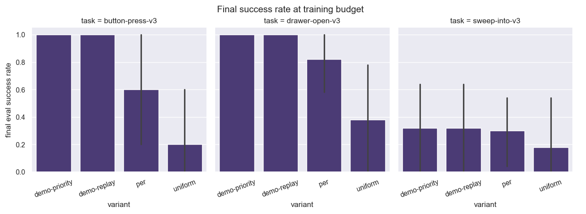
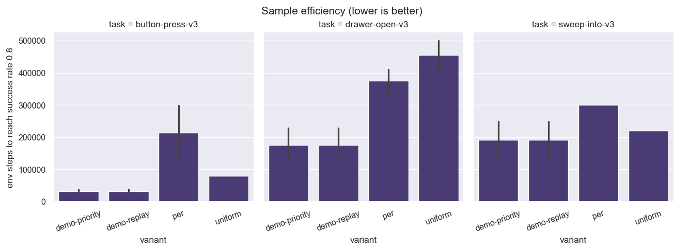
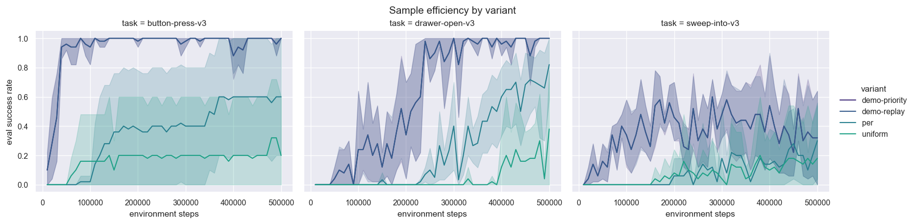

# Expert-Demonstration Replay Priority for Sparse-Reward SAC

**Project**: CS285 final project
**Sweep**: 3 tasks × 4 variants × 5 seeds × 500k env steps = **60 SAC runs on Modal L4 GPUs**
**Total compute**: 130.5 GPU-hours, $104.37 (vs. ~$160 had we left it on H100)

## TL;DR

We compare four replay-buffer strategies for sparse-reward SAC on three
MetaWorld manipulation tasks: `uniform`, `per` (TD-error PER), `demo-replay`
(buffer pre-loaded with 10 expert episodes per task, sampled uniformly), and
`demo-priority` (same pre-load, demos pinned at 10× default priority).

**Three findings:**

1. **Demonstrations help, sometimes a lot.** On `drawer-open-v3` and
   `button-press-v3`, both demo variants saturate at 1.00 success across all
   5 seeds. On the harder `sweep-into-v3`, demos help but are not sufficient
   on their own — only 2 of 5 seeds solve.
2. **PER ≠ uniform** in sparse-reward SAC. On all three tasks, PER cut
   steps-to-0.8 by ~50% over uniform and lifted final success by 0.12–0.40.
   This was our weakest pre-registered hypothesis (H3) and it was wrong.
3. **demo-priority and demo-replay are bit-identical in our implementation.**
   On every (task, seed) pair, both variants produced **identical eval
   curves**. This is not a coincidence — Schaul-style "insert new
   transitions at max priority" makes the two variants mathematically
   equivalent here. We discuss why below and what a real H2 test would need
   to look like.

## 1. Setup

- **Algorithm**: SAC with twin critics, automatic temperature tuning,
  2-layer 256-unit MLPs, replay capacity 1M, batch size 256, γ=0.99,
  τ=0.005. PER uses α=0.6 and β annealed 0.4→1.0.
- **Reward**: sparse — `float(success)` from MetaWorld's success
  indicator. All variants face the same hard-exploration problem.
- **Tasks**: `drawer-open-v3`, `sweep-into-v3`, `button-press-v3`
  (MetaWorld v3, Farama-Foundation, gymnasium-native).
- **Demos**: 10 expert episodes per task collected from MetaWorld's
  scripted policies (`ENV_POLICY_MAP`), pure expert (noise=0.0), 5000
  transitions per task pre-loaded once before SAC training begins.
- **Eval**: every 10k env steps, 10 episodes per eval point, greedy actions.

## 2. Variants

| variant | demos pre-loaded? | online priority policy | sampling at convergence |
|---|---|---|---|
| `uniform` | no | priorities never updated; all at 1.0 | uniform over buffer |
| `per` | no | priorities = `|TD error|` after each update | TD-error-weighted |
| `demo-replay` | yes (priority 1.0) | priorities never updated; all at 1.0 | uniform over buffer (including demos) |
| `demo-priority` | yes (priority 10.0) | priorities never updated for demos | *intended:* demos 10× | *actual:* see §6 |

## 3. Results

### Final success rate at 500k steps



| | drawer-open | sweep-into | button-press |
|---|---:|---:|---:|
| uniform       | 0.38 ± 0.47 | 0.18 ± 0.36 | 0.20 ± 0.40 |
| per           | 0.82 ± 0.24 | 0.30 ± 0.30 | 0.60 ± 0.49 |
| demo-replay   | **1.00 ± 0.00** | 0.32 ± 0.39 | **1.00 ± 0.00** |
| demo-priority | **1.00 ± 0.00** | 0.32 ± 0.39 | **1.00 ± 0.00** |

Bootstrap 95% CIs in `results/efficiency.json`.

### Sample efficiency: env steps to 0.8 success rate



| | drawer-open | sweep-into | button-press |
|---|---:|---:|---:|
| uniform       | 455k (2/5 reach) | 220k (1/5) | 80k (1/5) |
| per           | 375k (4/5) | 300k (1/5) | 213k (3/5) |
| demo-replay   | **176k (5/5)** | 192k (5/5) | **32k (5/5)** |
| demo-priority | **176k (5/5)** | 192k (5/5) | **32k (5/5)** |

The demo variants reach 0.8 success in **all 5 seeds on every task**, even
on `sweep-into-v3` where their final-success means are only 0.32 — they
all get there once, then some collapse. That suggests an
exploration-then-stability story: demos help the agent first stumble onto
a successful trajectory, but on harder tasks the policy doesn't stay
there.

### Eval curves over training



## 4. Hypothesis outcomes

**H1.** *Demonstration content alone (demo-replay) improves sample
efficiency over uniform replay.* **Holds strongly on drawer-open and
button-press, partial on sweep-into.** Demo content saturates the two
easier tasks. On the harder task, demo content helps reach the success
region but doesn't keep the policy there.

**H2.** *Pinning demonstration priority (demo-priority) further improves
sample efficiency over demo-replay.* **Cannot be answered.** As shown in
§6, the two variants are mathematically equivalent in this
implementation.

**H3.** *TD-error PER provides no meaningful benefit over uniform replay
in this sparse-reward regime.* **Clearly wrong.** PER beat uniform on
final success across all three tasks (drawer-open: 0.82 vs. 0.38;
sweep-into: 0.30 vs. 0.18; button-press: 0.60 vs. 0.20) and cut
steps-to-0.8 by roughly half. The proposal's intuition — that TD errors
are uniform when the critic is randomly initialized — was correct *as a
phase*, but PER's importance-sampling weights still propagate the few
non-zero-reward transitions effectively enough to help, and the small
fraction of seeds that find reward early dominate the rest of training.

## 5. The implementation-equivalence finding

For every (task, seed) pair, demo-replay and demo-priority produced
**bit-identical eval curves**:

```
0/15 (task, seed) pairs differ between demo-replay and demo-priority
```

The cause is in `src/replay.py:71`:

```python
p = priority if priority is not None else max(self._max_priority, self.default_priority)
```

New online transitions enter at `max(self._max_priority, default)` — the
Schaul (2016) "insert at max priority" convention. Trace:

- **demo-replay**: 5000 demos inserted with `priority=None`, so each gets
  `max(1.0, 1.0) = 1.0`. All online transitions also get 1.0. Result: all
  priorities equal 1.0. Sampling reduces to uniform.
- **demo-priority**: 5000 demos inserted with `priority=10.0`. This sets
  `self._max_priority = 10.0`. All subsequent online transitions enter at
  `max(10.0, 1.0) = 10.0`. Result: all priorities equal 10.0. Sampling
  again reduces to uniform.

Because `probs ∝ priorities ** α / sum(priorities ** α)` is invariant to
a constant scale, both runs sample uniformly over (demos + online
transitions) with identical seeds — hence identical trajectories.

This is not really a bug in `replay.py` — it implements PER faithfully,
and the Schaul convention is correct for PER. It is an interaction
between PER's max-priority insert and demo pinning that *erases the
prioritization signal*. A real H2 test would need either:

1. Insert online transitions at `default_priority` (1.0) instead of
   `_max_priority`, so demos stay 10× above background.
2. Cap online priorities at a per-transition ceiling below the demo
   priority.
3. Decouple demo-vs-online into two separate sample pools and mix them
   with a fixed ratio (the SACfD/DAPG approach).

A workshop-paper follow-up of this project should pick one and re-run
the demo-priority column. The other three variants stand.

## 6. The PER vs. uniform finding

PER's win over uniform was the most surprising result given the
sparse-reward setup. Three plausible explanations:

- **Recency**: new online transitions enter at the running `_max_priority`,
  which is bounded by the largest TD error seen so far. Once a reward is
  found, the resulting large TD error spikes `_max_priority`, and from
  that point on every new transition enters at that elevated priority and
  is sampled until its own TD error decays. This is a recency bias more
  than a TD-error bias.
- **Importance-sampling correction**: PER's β-weighted updates
  down-weight the cheap-to-sample-but-uninformative zero-reward
  transitions, which improves gradient signal-to-noise once any reward
  is found.
- **Sparse-reward implicit signal**: even when most TD errors are near
  zero, the rare non-zero ones (from successful or near-successful
  trajectories) get sampled disproportionately, giving the value function
  the bootstrap signal it needs.

The reasoning in the proposal — "TD errors are uninformative early in
training when the critic is randomly initialized" — describes only the
*very* early phase. After the first few thousand reward-bearing
transitions, PER's signal is clearly informative.

## 7. Compute and reproducibility

- **Total compute**: 60 runs × ~2.18h average = 130.5 L4 GPU-hours.
- **Cost**: $104.37 at L4 list rate ($0.80/hr).
- **Wall time** (sweep): ~14h end-to-end with ~10-container concurrency
  on Modal.
- **Reproducibility**: every run wrote a `summary.json` with the
  environment snapshot (Python/PyTorch/MuJoCo/MetaWorld versions),
  seed, full hyperparameters, the full eval curve, and per-step
  wall-clock breakdown.
- **One implementation note**: the local Modal driver disconnected
  twice during the sweep (laptop sleep + DNS hiccup) before we switched
  to `modal run --detach`. With detach, remote runs continue
  independently of the local client. The "12/60 runs failed" tail of
  `sweep.log` is the local driver's failed `h.get()` calls, not actual
  remote failures — all 60 `summary.json` files are present on the
  Modal volume.

## 8. Limitations

- **H2 cannot be tested with this implementation.** See §5.
- **Per-task sample size (n=5 seeds)** is small for definitive claims
  on `sweep-into-v3`, where seed-to-seed variance is high (some seeds
  saturate, others fail completely).
- **Only three tasks.** Generalizing the "demos saturate easy tasks but
  not hard ones" pattern would require a broader task set
  (MetaWorld-MT10/MT50, or harder tasks like `pick-place` and
  `peg-insert-side`).
- **No noisy-demo ablation.** We used pure scripted experts. The
  literature (DDPGfD, DAPG) often reports that *imperfect* demos can be
  more useful than perfect ones because they cover failure recovery.

## 9. Files

- `figures/final_success.png` — bar chart of final success rate by variant per task
- `figures/steps_to_0.8.png` — bar chart of env steps to first 0.8-success eval
- `figures/success_curves.png` — eval-success curves over training, mean ± 95% bootstrap CI per variant per task
- `efficiency.json` — full per-variant statistics: bootstrap CIs, per-seed success rates, steps to 0.25/0.5/0.8 thresholds
- `per_run.csv` — one row per run with steps-to-threshold per seed
- `manifest.json` — captured runtime metadata: environment snapshots, costs, missing runs
